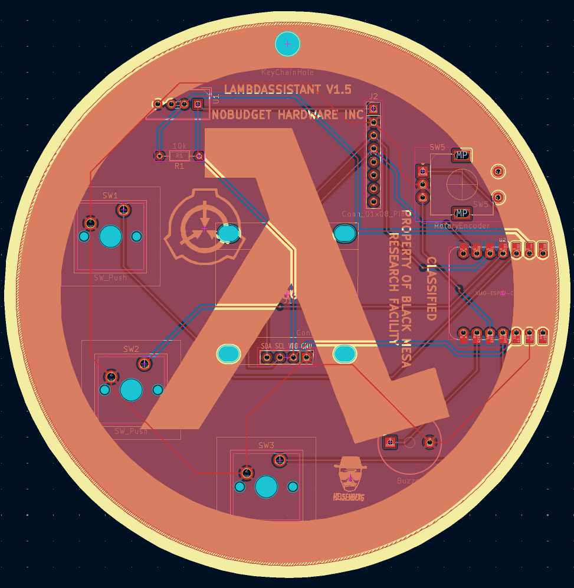
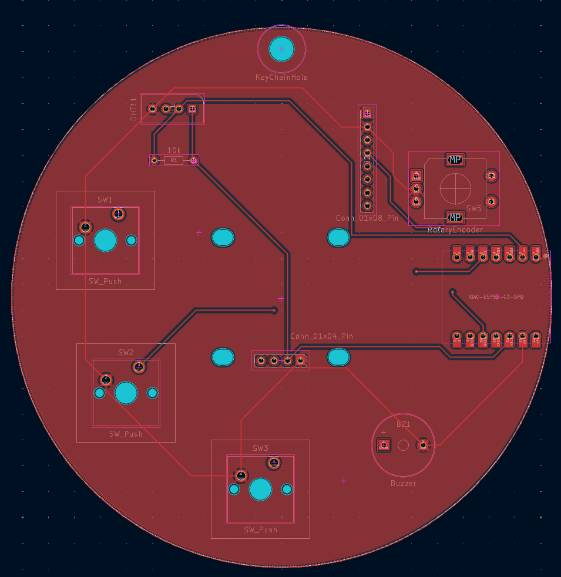
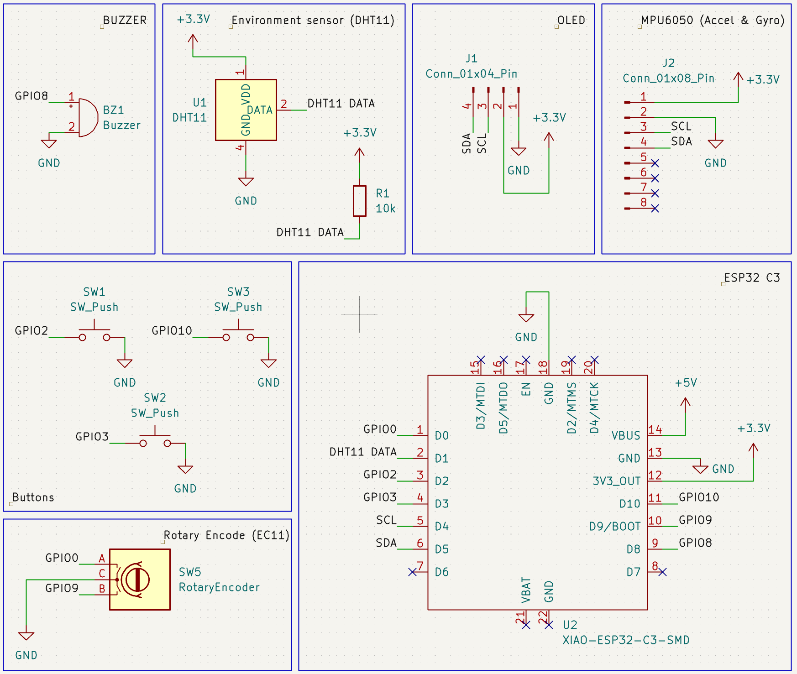

# Lambdassistant

## V1

## V2
WIP

This device was designed for week one of Hackclub [Half Life](https://halflife.hackclub.com/) (hence the reference)
This is a motion controlled tamagotchi like device, comprised of three buttons, a DHT11 environment sensor, motion sensor, buzzer and screen
