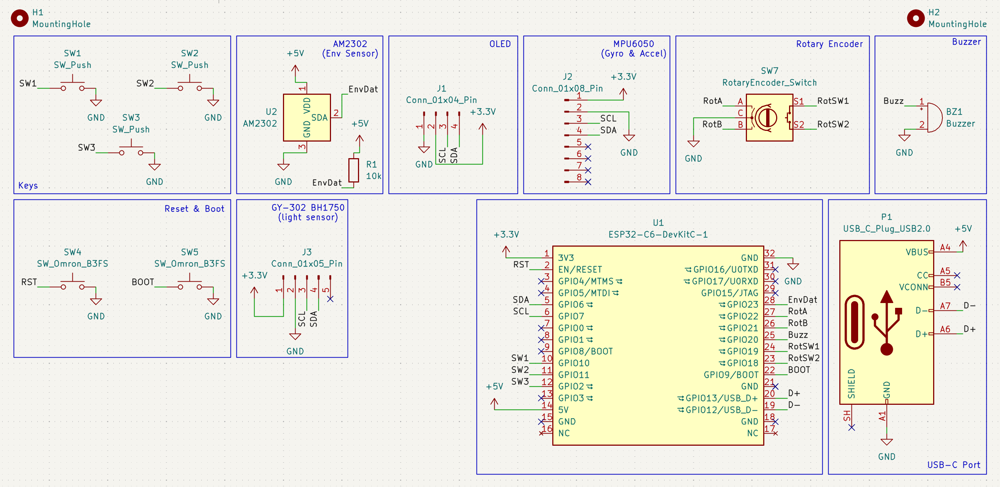
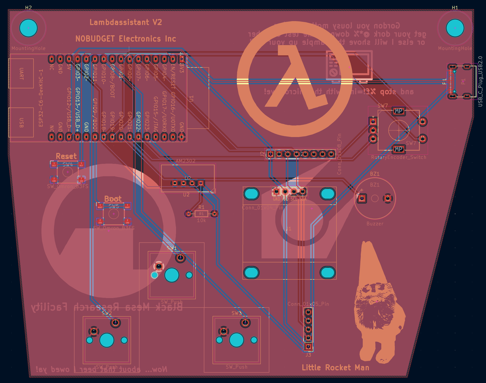
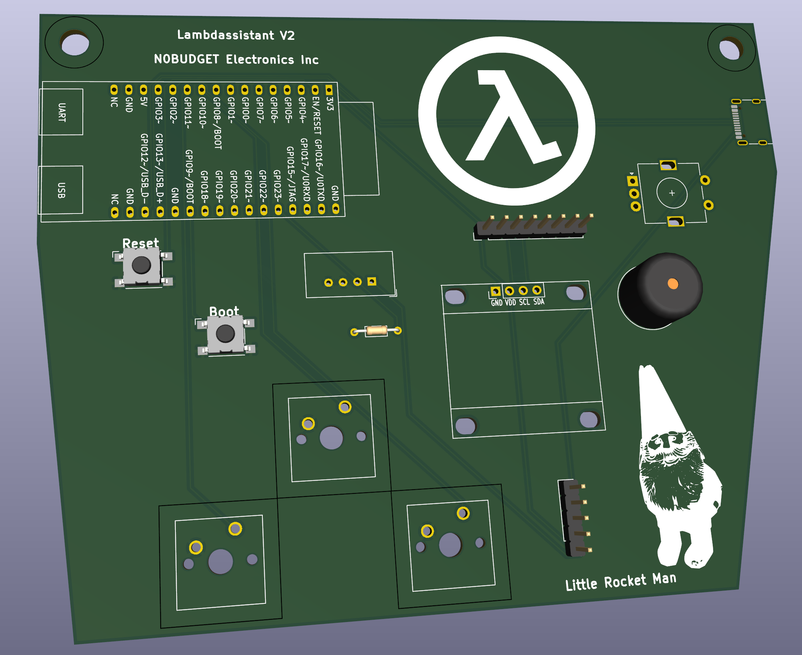
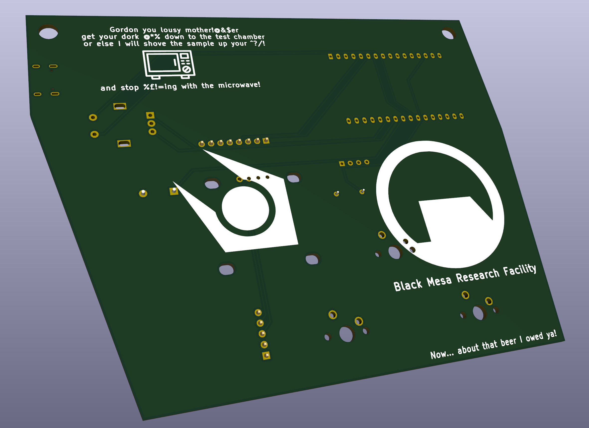

# Lambdassistant

## V1

## V2

This device was designed for week one of Hackclub [Half Life](https://halflife.hackclub.com/) (hence the reference)
This is a motion controlled tamagotchi like device comprised of: 
- Five buttons (three main, reset and boot)
- Rotary encoder (also a button)
- AM2302 environment sensor (temp and humidity)
- MPU6050 motion sensor
- GY-302 BH1750 light sensor
- Buzzer
- OLED screen
